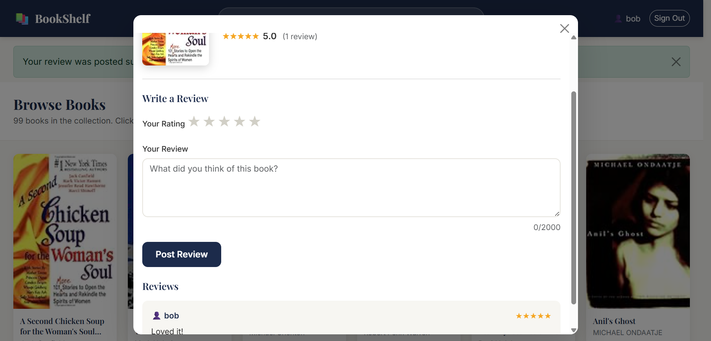
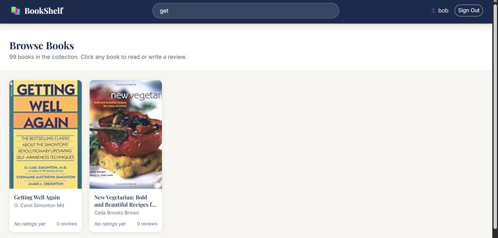

# BookShelf- Book Review Website

A full-stack book review web application built with Python/Flask. Users can browse a curated library of books, read community reviews, and post their own star-rated reviews after signing in.

---

## Table of Contents

- [Features](#features)
- [Tech Stack](#tech-stack)
- [Architecture](#architecture)
- [Getting Started](#getting-started)
- [Environment Variables](#environment-variables)
- [CLI Commands](#cli-commands)
- [Security](#security)
- [Project Structure](#project-structure)


---

## Frontend quick Login
Username: bob
Password: bobpass

---

## Features

- **JWT Authentication** — Secure cookie-based login/logout with token expiry
- **Book Catalog** — Browse 99+ books with cover images, author, publisher, and publication year
- **Star Ratings** — Interactive 1–5 star rating widget per book
- **Reviews** — Write and read community reviews on any book
- **Live Search** — Instant client-side filtering by title, author, or ISBN
- **Responsive Design** — Works on desktop, tablet, and mobile
- **Input Validation** — Both client-side and server-side validation on all forms

---

## Book Review Website Screenshots






---

## Tech Stack

| Layer       | Technology                        |
|-------------|-----------------------------------|
| Backend     | Python 3.8 · Flask 3              |
| Database    | SQLite (dev) via SQLAlchemy ORM   |
| Auth        | Flask-JWT-Extended (HTTP cookies) |
| Frontend    | Jinja2 · Bootstrap 5.3 · Vanilla JS |
| Typography  | Google Fonts — Playfair Display · Inter |
| Server      | Gunicorn (production)             |

---

## Architecture

```
BookShelf/
├── App/
│   ├── __init__.py       # App factory — config, extensions, JWT callbacks
│   ├── main.py           # Blueprint with all route handlers
│   ├── models.py         # SQLAlchemy models: User, Book, Review
│   ├── static/
│   │   ├── style.css     # Custom design system
│   │   └── main.js       # Search, modal, star-rating, form validation
│   └── templates/
│       ├── login.html    # Auth page
│       ├── index.html    # Main library view
│       └── error.html    # Generic error page (404, 500)
├── instance/
│   └── app.db            # SQLite database (auto-created)
├── books.csv             # 99-book seed dataset
├── wsgi.py               # Entry point + Flask CLI commands
├── requirements.txt      # Python dependencies
└── .flaskenv             # Flask environment config
```

**Request flow:**
```
Browser → Flask route (main.py Blueprint) → SQLAlchemy ORM → SQLite
                ↕ JWT cookie verified on every protected route
```

---

## Getting Started

### 1. Install dependencies

```bash
pip install -r requirements.txt
```

### 2. Set environment variables (recommended)

Copy and configure the secrets:

```bash
export SECRET_KEY="your-strong-random-secret"
export JWT_SECRET_KEY="your-strong-jwt-secret"
```

Or create a `.env` file (requires `python-dotenv`).

### 3. Initialise the database and seed books

```bash
flask init
```

This creates all database tables and imports 99 books from `books.csv`.

### 4. Create a user account

```bash
flask create-user alice securepassword123
```

### 5. Run the development server

```bash
flask run
```

Open [http://localhost:8080](http://localhost:8080) and sign in with the credentials you created.

---

## Environment Variables

| Variable        | Default (dev)                              | Description                        |
|-----------------|--------------------------------------------|------------------------------------|
| `SECRET_KEY`    | `dev-secret-please-change-in-production`   | Flask session secret               |
| `JWT_SECRET_KEY`| `jwt-dev-secret-please-change-in-production` | JWT signing key                  |
| `DATABASE_URL`  | `sqlite:///instance/app.db`                | SQLAlchemy database URI            |
| `FLASK_ENV`     | `development`                              | Set to `production` to enable secure cookies |

> **Important:** Always set strong, random values for `SECRET_KEY` and `JWT_SECRET_KEY` in production. Never commit secrets to version control.

---

## CLI Commands

| Command                              | Description                              |
|--------------------------------------|------------------------------------------|
| `flask init`                         | Create DB tables and seed books from CSV |
| `flask create-user <username> <pass>`| Create a new user account                |
| `flask list-books`                   | List all books in the database           |
| `flask list-users`                   | List all registered users                |

---

## Security

- **Password hashing** — Werkzeug `generate_password_hash` (PBKDF2-SHA256)
- **JWT in HttpOnly cookies** — Tokens are never exposed to JavaScript
- **Cookie security** — `Secure` flag enabled automatically when `FLASK_ENV=production`
- **Input validation** — Rating clamped to 1–5; review text capped at 2,000 characters; all inputs stripped and validated server-side
- **SQLAlchemy ORM** — Parameterised queries prevent SQL injection
- **Secrets via environment variables** — No hardcoded credentials in source code
- **JWT error handling** — Expired, invalid, and missing tokens all redirect to login gracefully

---

## API Routes

| Method | Route                  | Auth Required | Description                     |
|--------|------------------------|---------------|---------------------------------|
| GET    | `/`                    | No            | Login page                      |
| POST   | `/login`               | No            | Authenticate and set JWT cookie |
| GET    | `/logout`              | No            | Clear JWT cookie and redirect   |
| GET    | `/app`                 | Yes           | Main book catalog view          |
| POST   | `/add-review/<isbn>`   | Yes           | Submit a review for a book      |

---
